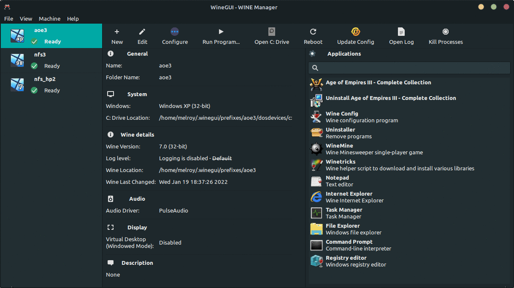

# WineGUI

At last, a user-interface friendly [Wine](https://www.winehq.org/) (A compatibility layer capable of running Windows applications under Linux) Manager.

[](https://gitlab.melroy.org/melroy/winegui/-/pipelines/latest)
[](https://t.me/winegui)
[](https://matrix.to/#/#winegui:melroy.org)
[](https://gitlab.melroy.org/melroy/winegui/-/releases)



## Download

You can find the latest version on the [Releases page](https://gitlab.melroy.org/melroy/winegui/-/releases).

Download the WineGUI package you require for your Linux distribution (we provided `.deb`, `.rpm` and `.tar.gz` files). Typically you should use `.deb` file for Ubuntu and Linux Mint distros.

Install the package and you are ready to go! WineGUI should be listed in your menu.

## Features

- **Graphical user-interface** on top of [Wine](https://www.winehq.org/)
- Creating a new machine using an **easy step-by-step wizard**
- **Application list** per machine (with _search feature_)
- Editing and removing Windows machines in a _breeze_
- Configure window **installing additional software** with just a single click (like installing DirectX)
- **One-button click** to run a program, open the `C:` drive, simulate a reboot or kill all processes

## GitHub Star History

[](https://star-history.com/#winegui/WineGUI&Date)

## Development

WineGUI is created by using [GTK3 toolkit](https://www.gtk.org/) (Gtkmm C++-interface) and C++ code.

Development has been done in VSCcodium, using the following extensions:

- C/C++
- CMake
- CMake Tools
- GitLab Workflow

### Documentation

See latest [WineGUI Developer Docs](https://gitlab.melroy.org/melroy/winegui/-/jobs/artifacts/main/file/doc/doxygen/index.html?job=test-build).

### Requirements

Dependencies should be met before build:

- gcc/g++ (adviced: v8 or later)
- cmake (adviced: v3.10 or later)
- ninja-build
- libgtkmm-3.0-dev (implicit dependency with libgtk-3-dev)
- libjson-glib-dev
- pkg-config

Optionally:

- doxygen
- graphviz
- rpm
- cppcheck

**Hint:** You could execute `./scripts/deps.sh` script for Debian based systems (incl. Ubuntu and Linux Mint) in order to get all the dependencies installed automatically.

### Build

Run: `./scripts/build.sh`

Or execute: `mkdir -p build && cd build && cmake -GNinja .. && ninja`

### Run

Execute within the build directory: `ninja run`

Or:

```sh
./build/bin/winegui
```

### Rebuild

Cmake is only needed once, after that you can often use:

`ninja`

Clean the build via: `ninja clean`

_Hint:_ Run `ninja help` for all available targets.

### Debug

You can use the helper script: `./scripts/build_debug.sh`

Start debugging in [GDB (GNU Debugger)](https://cs.brown.edu/courses/cs033/docs/guides/gdb.pdf):

```sh
cd build_debug
gdb -ex=run bin/winegui
```

### Memory check

First **build** the (Linux) target including _debug symbols_. Binary should be present in the `build/bin` folder.

Next, check for memory leaks using `valgrind` by executing:

```sh
./scripts/valgrind.sh
```

Or to generate a memory usage plot in [massif format](https://valgrind.org/docs/manual/ms-manual.html), execute:

```sh
./scripts/valgrind_plot.sh
```

### Production

For production build and DEB file package, you can run: `./scripts/build_prod.sh`

Or use:

```sh
cmake -DCMAKE_BUILD_TYPE=Release
ninja
```

### Build Doxygen

Or build with generated doxygen files locally:

```sh
cmake -GNinja -Ddoc=ON
ninja
```

### Releasing

Before you can make a new release, align the version number in WineGUI with the version you want to release.
Then create a new tagged version in Gitlab with the same version name.

_Note:_ Only a `release tag` on the `main` branch will trigger the publish task.

### Automated Clang Format

We use our [own Clang LLVM C++ Programming Style Format](.clang-format), using [clang-format](https://clang.llvm.org/docs/ClangFormat.html) command.

To automatically comply to our style format execute following script (inplace edits are performed for you):

```sh
./scripts/fix-format.sh
```

Check only for errors, run: `./scripts/check-format.sh`

### Guidelines

First we try to use the [Google C++ Style Guide](https://google.github.io/styleguide/cppguide.html) as basis.

Next, we also tend to follow the popular [C++ Core Guidelines](http://isocpp.github.io/CppCoreGuidelines/CppCoreGuidelines) as much as possible.

### CI/CD

For continuous integration & delivery we use our [Dockerfile](misc/Dockerfile) to create a Docker image.
This image (`danger89/gtk3-docker-cmake-ninja`) is hosted on [Dockerhub](https://hub.docker.com/r/danger89/gtk3-docker-cmake-ninja).

A helper script can be used: `./scripts/build_and_upload_image.sh`
